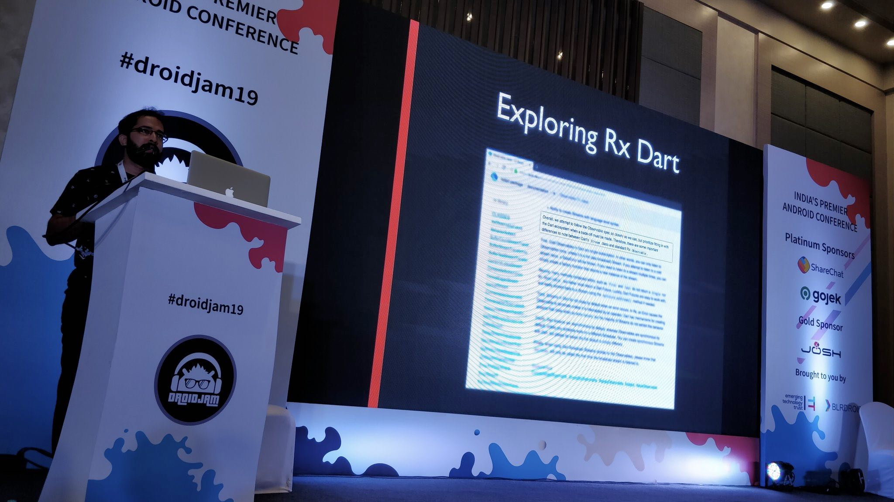

Hi There 🖖.

I'm Anvith, I create and design stuff around android. I enjoy building with disparate 
platforms be it Kotlin, JS, Flutter or others. I love running the extra mile when it comes
to UI/UX. Architecture mood swings between _&nbsp;If it fits.. it sits&nbsp;_ to _&nbsp;Why so coupled!&nbsp;_.
I've also built a few projects notable of which was [CryptoNiffler - India's first crypto arbitrage app](https://play.google.com/store/apps/details?id=com.bariski.cryptoniffler).

I work as a Lead Mobile Engineer at [Fueled](https://fueled.com) and in the past have have worked 
with a bunch of startups around mobile and web, including an unsually long stint at a 
corporate MNC. I dish out code during the day and electronic bullets by the night. I love
nature documentaries.

House MD is my favorite show. 

_<blockquote>'George Carlin made me smile, Jimmy Carr makes me laugh.'</blockquote>_

